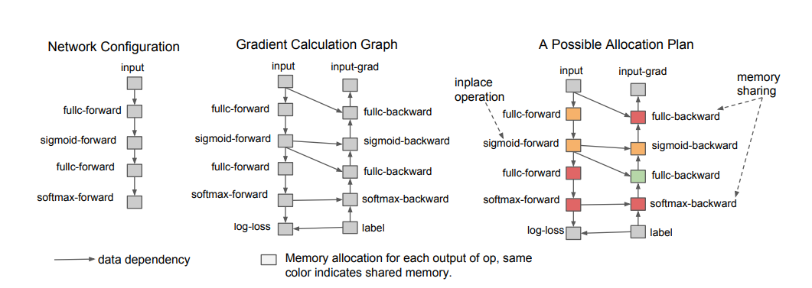

# Training Deep Nets with Sublinear Memory Cost

> Computation graph and possible memory allocation plan of a two layer fully connected neural network training procedure. Each node represents an operation and each edge represents a dependency between the operations. The nodes with the same color share the memory to store output or back-propagated gradient in each operator. To make the graph more clearly, we omit the weights and their output gradient nodes from the graph and assume that the gradient of weights are also calculated during backward operations. We also annotate two places where the in-place and sharing strategies are used.

This code is the Pytorch implementation of the paper [Training Deep Nets with Sublinear Memory Cost](https://arxiv.org/pdf/1604.06174.pdf).

## Requirements
* Pytorch
* torchvision

## Run
You can run MNIST experiments by running following command. 
```
python mnist_full.py
```

## Citation

If you use this code in your work, please cite this paper:  

```none
@article{chen2016training,
  title={Training deep nets with sublinear memory cost},
  author={Chen, Tianqi and Xu, Bing and Zhang, Chiyuan and Guestrin, Carlos},
  journal={arXiv preprint arXiv:1604.06174},
  year={2016}
}
```
